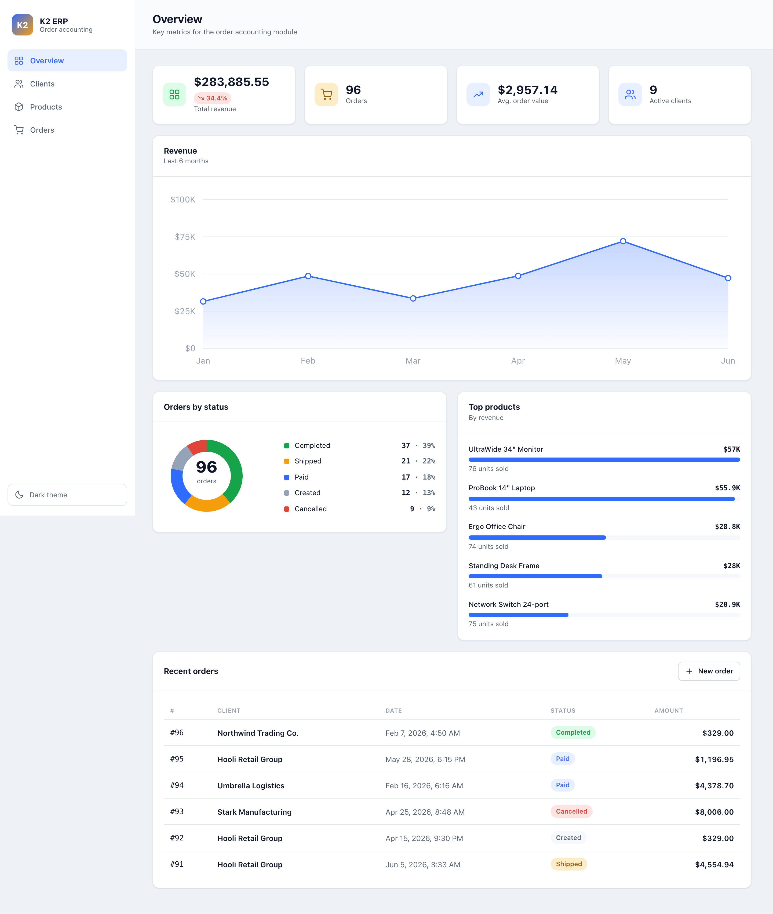
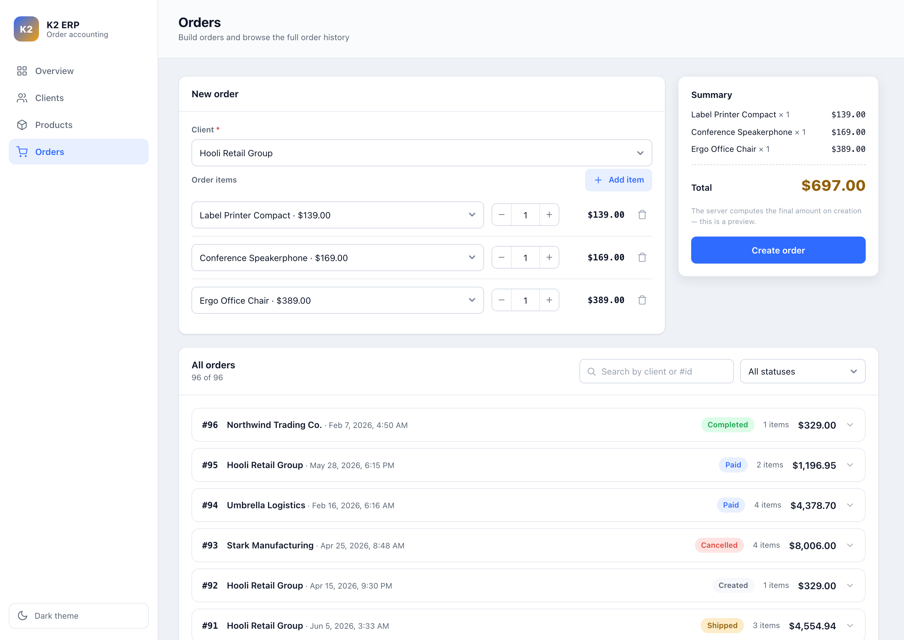
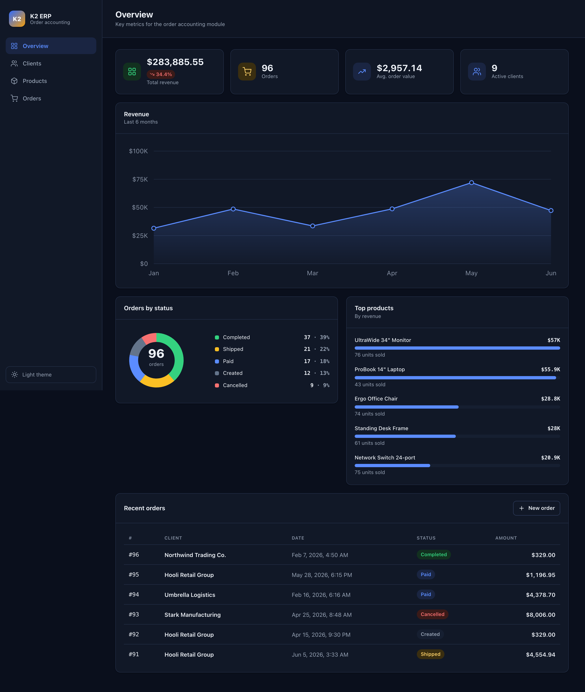
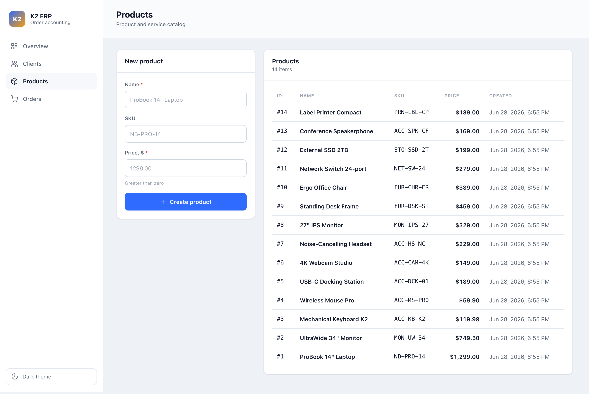
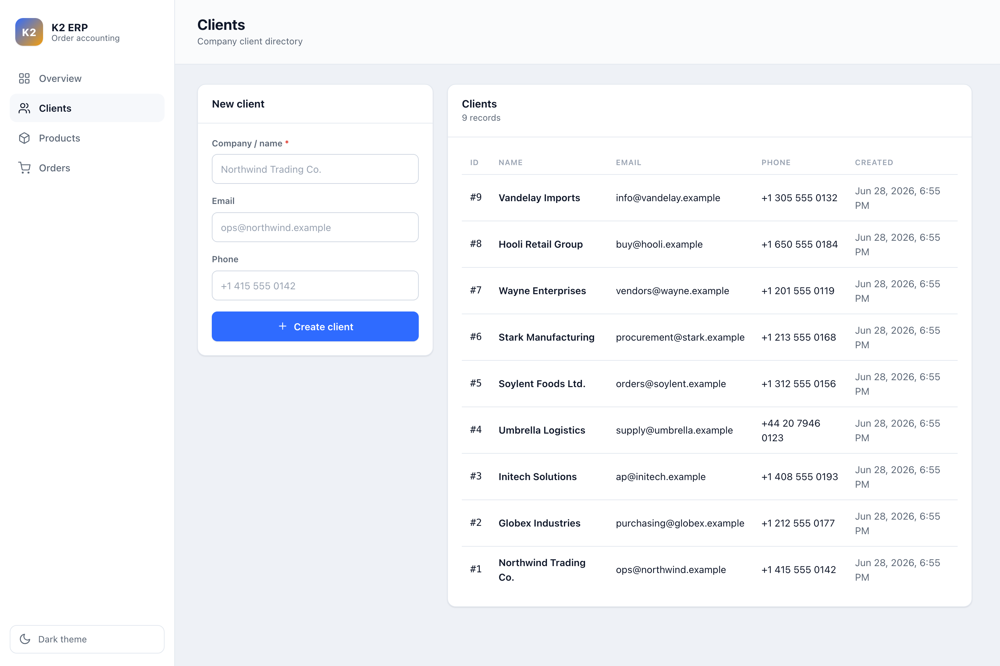
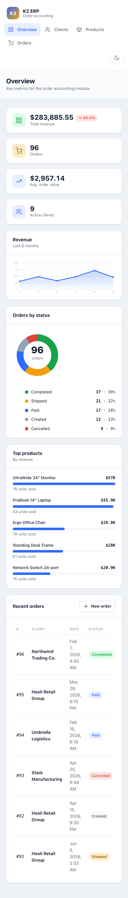

# K2 ERP — Order Accounting Module

A compact but production-shaped **order management** module: a **Python / Flask
REST API** backed by **SQLite / PostgreSQL**, with a **React + TypeScript**
single-page app that turns operational data into a clean analytics dashboard.

Order totals are computed **server-side**, and each line item **snapshots** the
product price at order time — the way real accounting systems work.



<table>
  <tr>
    <td width="50%"></td>
    <td width="50%"></td>
  </tr>
  <tr>
    <td width="50%"></td>
    <td width="50%"></td>
  </tr>
</table>

<p align="center"></p>

---

## Highlights

- **Analytics dashboard** — KPI cards (revenue, orders, average order value,
  active clients with month-over-month delta), a 6-month revenue trend, an
  orders-by-status donut, and a top-products-by-revenue ranking.
- **Order builder** — pick a client, add line items with a live, server-verified
  total preview, then create the order in one atomic transaction.
- **Filterable order history** — full order list with text search (client / id)
  and status filtering, plus expandable per-order line items.
- **Clean, layered backend** — thin controllers, all domain rules in a service
  layer, Pydantic validation at the edge, a unified JSON error format.
- **Dependency-free charts** — every chart is hand-built inline SVG/CSS, so the
  frontend ships no charting library.
- **Design system** — reusable components, design tokens, light/dark themes,
  empty/loading/error states, accessibility, and responsive layout.
- **Tested** — 21 backend tests (business rules + analytics aggregation) and
  8 frontend tests (API client, formatting, components).

## Tech stack

| Layer | Technologies |
|---|---|
| Backend | Python 3.12, Flask, Flask-SQLAlchemy (SQLAlchemy 2.0), Pydantic v2 |
| Database | SQLite (default) / PostgreSQL (via `DATABASE_URL`) |
| Frontend | React 18, TypeScript, Vite |
| Tests | pytest (backend), Vitest + Testing Library (frontend) |
| DevOps | Docker (multi-stage), docker-compose, gunicorn |

## Architecture

```
React + TS (Vite SPA)
        │  fetch /api/*  (typed client)
        ▼
Flask (app factory)
  routes  ──►  schemas (Pydantic: validation + serialization)
     │
     ▼
  services (business rules + transactions)
     │
     ▼
  models (SQLAlchemy 2.0)  ──►  SQLite | PostgreSQL
```

Layers are separated on purpose: controllers stay thin and all domain logic
lives in `services`, which keeps it easy to test and reuse.

## Project structure

```
k2-erp-orders/
├── app/                  # Backend
│   ├── __init__.py       # create_app(): factory, DB, error handlers, SPA serving
│   ├── config.py         # env-driven config (DATABASE_URL)
│   ├── models.py         # Client, Product, Order, OrderItem
│   ├── schemas.py        # Pydantic: *Create / *Out + analytics schemas
│   ├── services.py       # business logic, transactions, analytics aggregation
│   ├── errors.py         # domain errors + unified JSON error format
│   └── routes.py         # /api endpoints
├── tests/                # pytest (business rules + analytics)
├── frontend/             # React + TypeScript (Vite)
│   └── src/
│       ├── api/          # typed client + types
│       ├── components/   # design system + charts/ (SVG charts)
│       ├── views/        # Dashboard / Clients / Products / Orders
│       └── styles.css    # design tokens + themes
├── seed.py               # deterministic demo data for screenshots / local use
├── Dockerfile            # multi-stage: build SPA → backend + bundled SPA
└── docker-compose.yml    # app (+ optional postgres profile)
```

## Quick start

### Option A — Docker (one container: API + SPA)

```bash
docker compose up --build
# open http://localhost:5000
```

### Option B — local

**Backend:**
```bash
python3 -m venv .venv && source .venv/bin/activate
pip install -r requirements.txt
python seed.py        # optional: load demo data (clients, products, 96 orders)
python run.py         # http://localhost:5000
```

**Frontend (dev server with hot-reload, proxies /api → :5000):**
```bash
cd frontend
npm install
npm run dev           # http://localhost:5173
```

For a production build the Flask app serves the SPA from `frontend/dist`:
`cd frontend && npm run build`, then open `http://localhost:5000`.

## Database (SQLite / PostgreSQL)

The connection is controlled by `DATABASE_URL` — the code is identical for both:

```bash
# SQLite (default)
export DATABASE_URL="sqlite:///k2_erp.db"

# PostgreSQL
export DATABASE_URL="postgresql+psycopg://k2:k2@localhost:5432/k2_erp"
```

Bring up Postgres via compose: `docker compose --profile postgres up`.
The schema is created automatically on start (`db.create_all()`).

## API

Base prefix `/api`. Errors use a single shape:
`{"error": {"code": "...", "message": "...", "details": [...]}}`.

| Method | Path | Description |
|---|---|---|
| GET | `/api/health` | Health check |
| GET | `/api/stats` | Headline counts (clients, products, orders, revenue) |
| GET | `/api/analytics` | KPIs, revenue-by-month, orders-by-status, top products |
| GET / POST | `/api/clients` | List / create clients |
| GET / POST | `/api/products` | List / create products |
| GET / POST | `/api/orders` | List (opt. `?client_id=`) / create orders |
| GET | `/api/orders/<id>` | Single order |
| GET | `/api/clients/<id>/orders` | Orders for a client |

```bash
# Create an order — the server computes the total
curl -X POST localhost:5000/api/orders \
  -H 'Content-Type: application/json' \
  -d '{"client_id":1,"items":[{"product_id":1,"quantity":2}]}'
# → {"id":1,"total_amount":"2598.00","status":"created", ...}
```

> Money is always serialized as a string (`"2598.00"`) to preserve precision.

## Business rules

| Rule | Enforced by |
|---|---|
| An order cannot exist without a client | NOT NULL FK + service check (404) |
| An order needs ≥ 1 item | Pydantic `min_length=1` + service check |
| The total is computed server-side | `services.create_order` (client total ignored) |
| Every referenced product must exist | `services` (404, transaction rollback) |
| Order prices never change afterwards | `unit_price` snapshot on `OrderItem` |

Order creation is **atomic** — any error rolls the whole transaction back.

## Tests

```bash
# Backend — 21 tests
.venv/bin/pytest -q

# Frontend — 8 tests
cd frontend && npm test
```

## What this project demonstrates

- Building **custom dashboards and admin panels** end to end: data model →
  API → typed client → analytics UI.
- **API-backed data flows** with server-side aggregation (KPIs, time series,
  status and product roll-ups) that work on both SQLite and PostgreSQL.
- **Tables, filters, charts, KPIs and reports** assembled into a coherent,
  themeable internal tool — without leaning on a UI/charting framework.
- A **clean, layered, tested** full-stack codebase with Docker packaging.
